

    
<h1 align="center">Kraken</h1>

<h1 align="center">GRUPO 6 - Integrantes</h1>

#### Miguel Parra - ma.parrat@uniandes.edu.co
#### Geovanny Gomez - g.gomezo2@uniandes.edu.co
#### Miguel Rincon - ma.rinconr1@uniandes.edu.co

# 🔨 Instalación

## Detalle técnico
- Sistema Operativo - Microsoft Windows 10 Pro Versión 10.0.19045
- Versión Node: v18.18.2
- Versión Ghost: 5.74
- Versión Ghost-CLI: 1.25.3
- Ambiente de desarrollo

### Instalación Node en Windows 10 Pro

- Descargar el instalador del sitio oficial https://nodejs.org/download/release/v18.18.2/node-v18.18.2-x64.msi 
- Ejecutarlo con privilegios de administrador, oprimir Next:
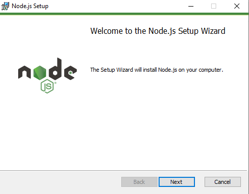
- Aceptar el acuerdo de licencia y oprimir Next:

- Continuar la instalación con Next:
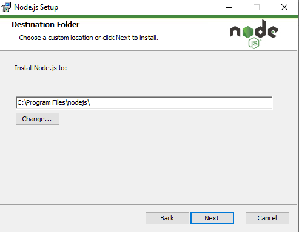
- Continuar la instalación con Next:
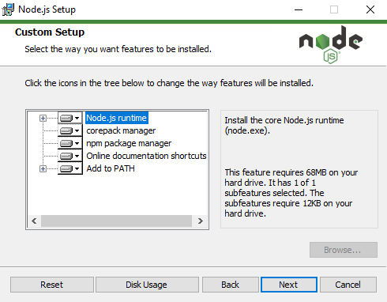
- Continuar con Next:
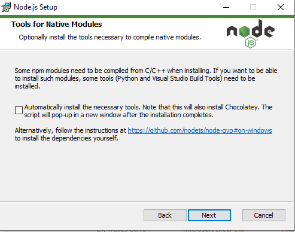
- Oprimir el botón de install:
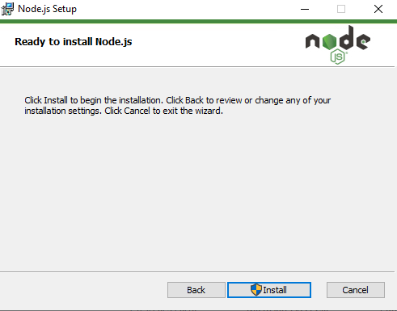
- Esperar hasta que finalice la instalación:
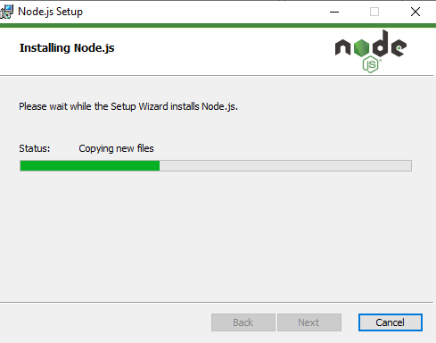
- Finalizar la instalación:
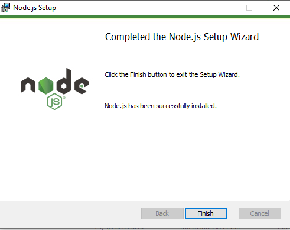

### Instalación Ghost-CLI en Windows 10 Pro
- Ingresar a la consola de Node.js command prompt
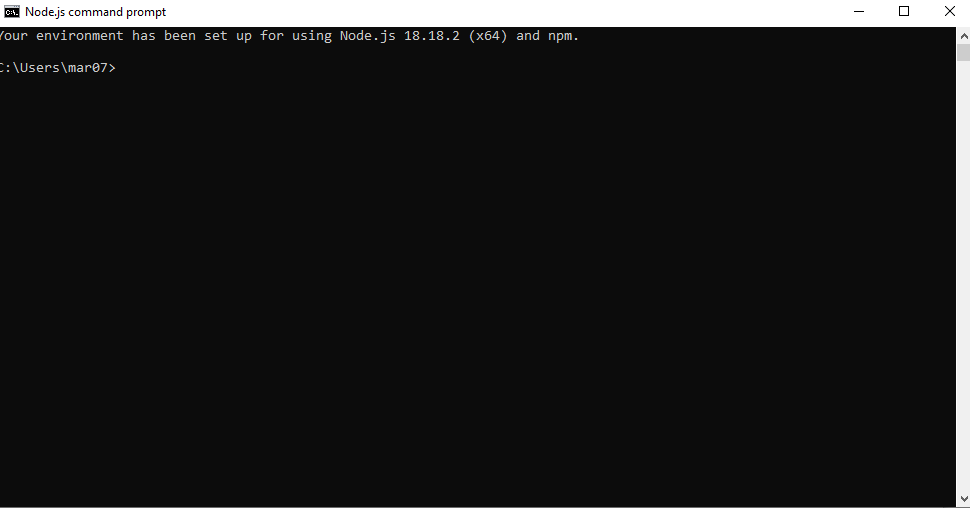
- Ejecutar el comando npm init:
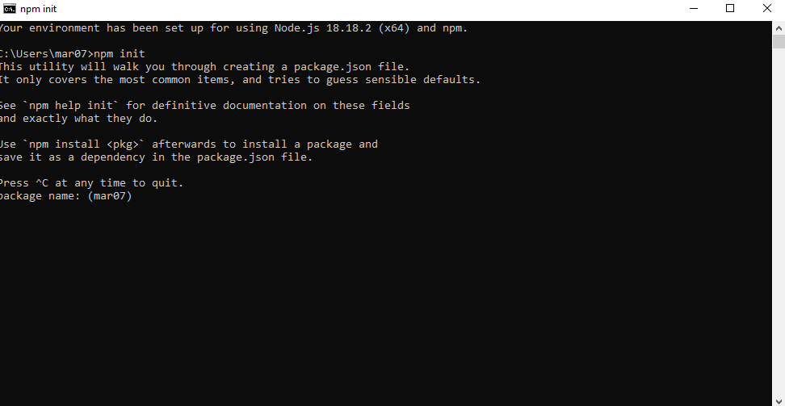
- Ingresar el nombre del paquete, paquete_ghost:
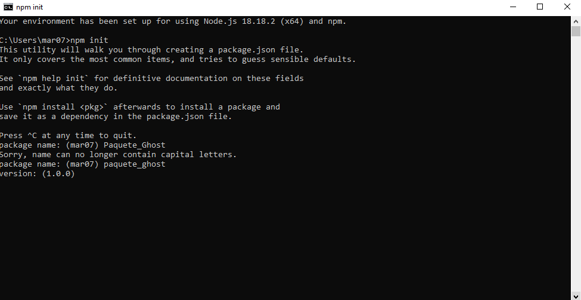 
- Confirmar la versión:
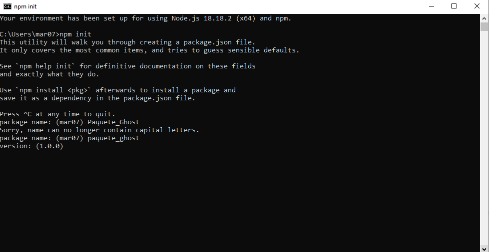
- Ingresar la información como se indica en pantalla y confirmar ingresando "yes" la configuración:
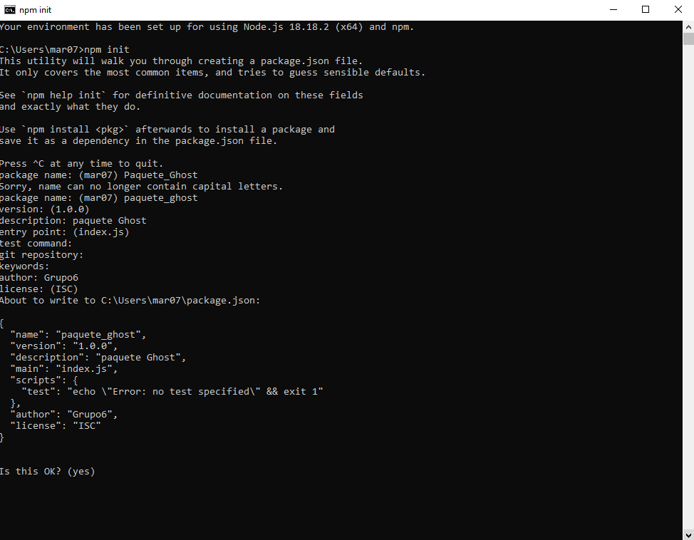
- Se confirma la parametrización
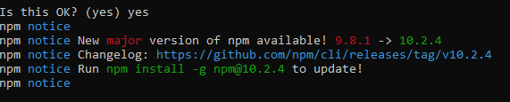
- Ejecutar el comando npm install ghost-cli@latest -g para instalar la última versión de Ghost-CLI:
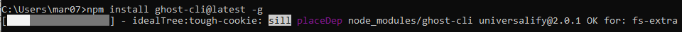
- Al finalizar se muestra lo siguiente:
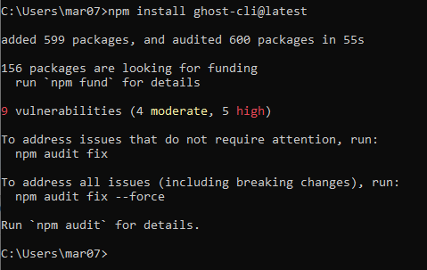
- Validar la versión de las herramientas con el comando: ghost -v
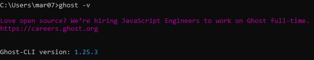

### Instalación Ghost local en Windows 10 Pro
- Ejecutar el comando ghost install local -d Ghost en la consola de Node.js command prompt
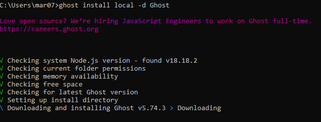
- Permitir el acceso de Firewall
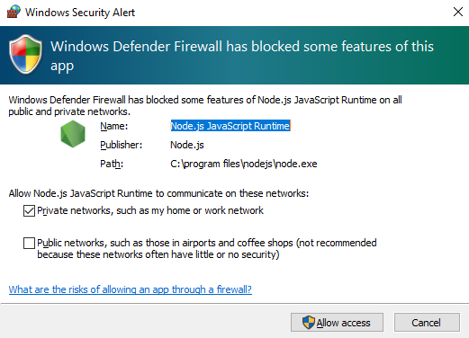

- Ghost queda instalado en la URL por defecto
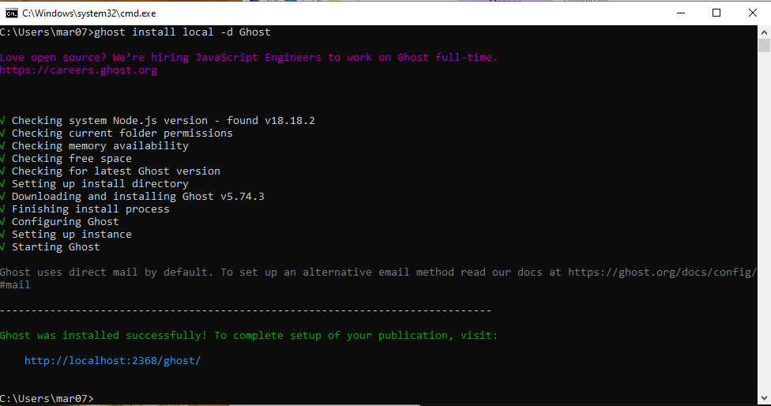

- Ingresar a Ghost en un navegador y configurar los parametros iniciales
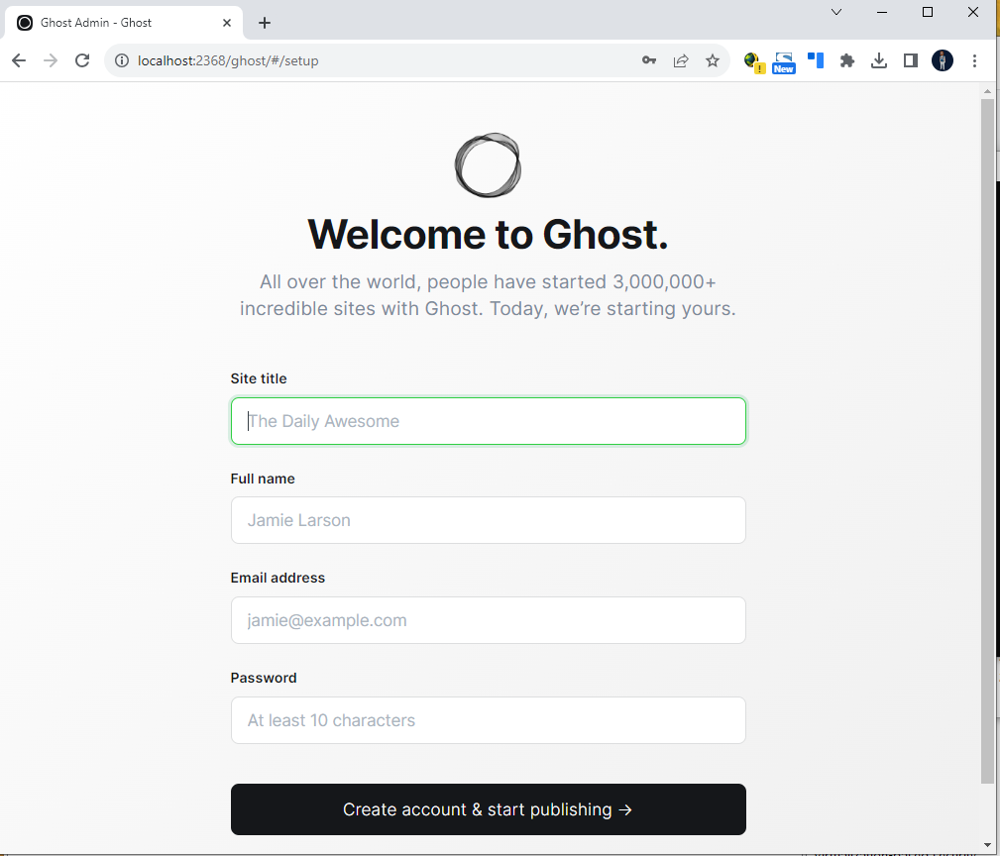
- Oprimir el boton crear cuenta y comenzar publicacion:
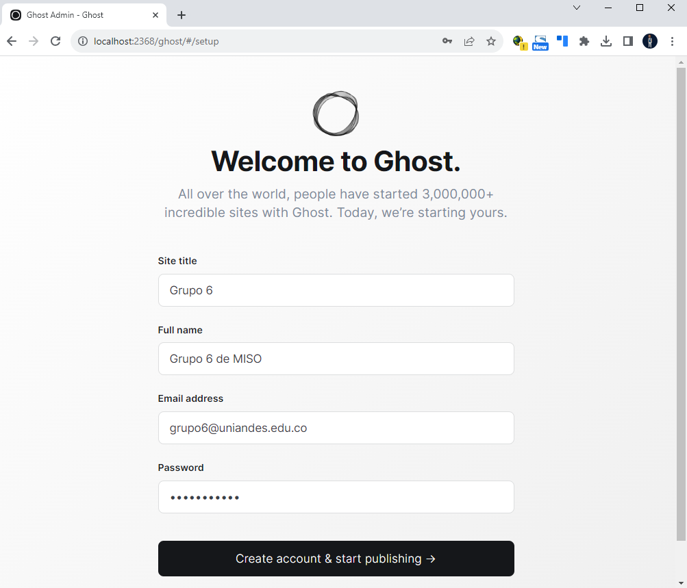

- Hemos finalizado la instalación de Ghost

### Instalación Kraken en Windows 10 Pro